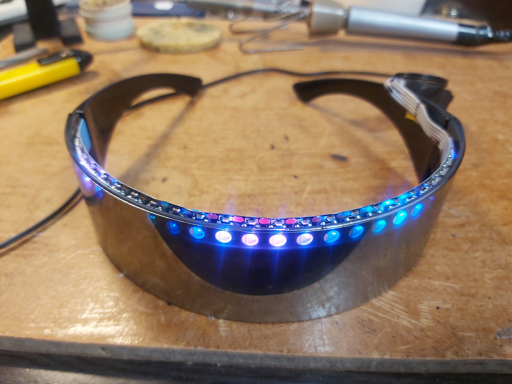
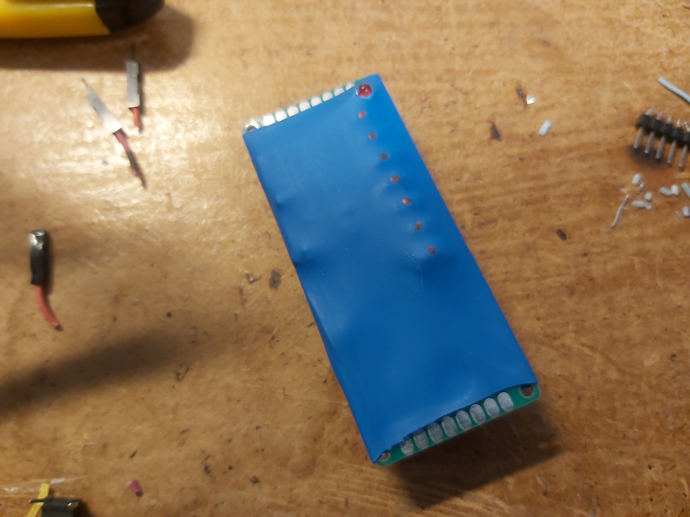
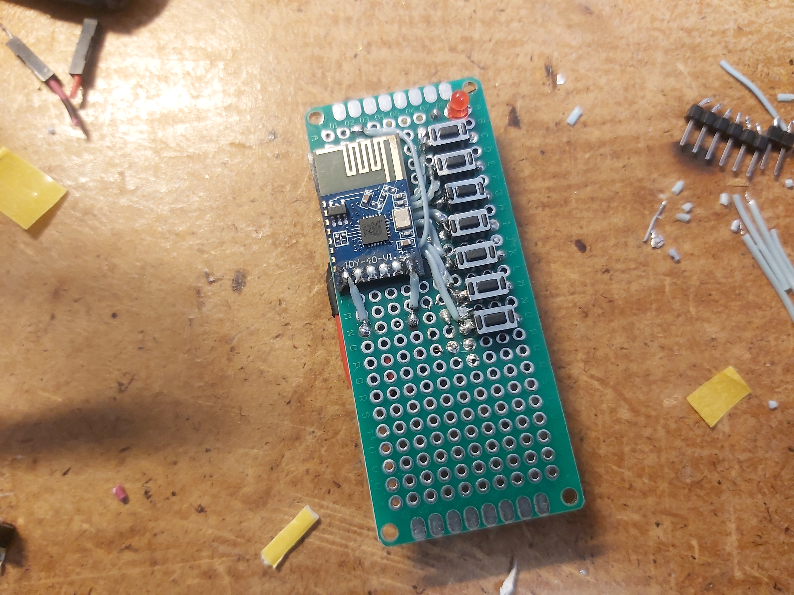
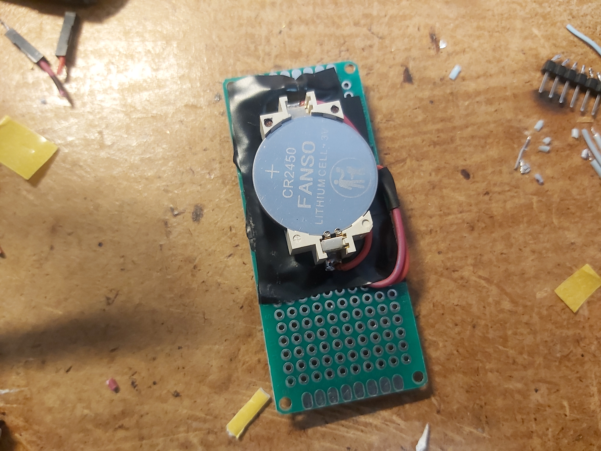
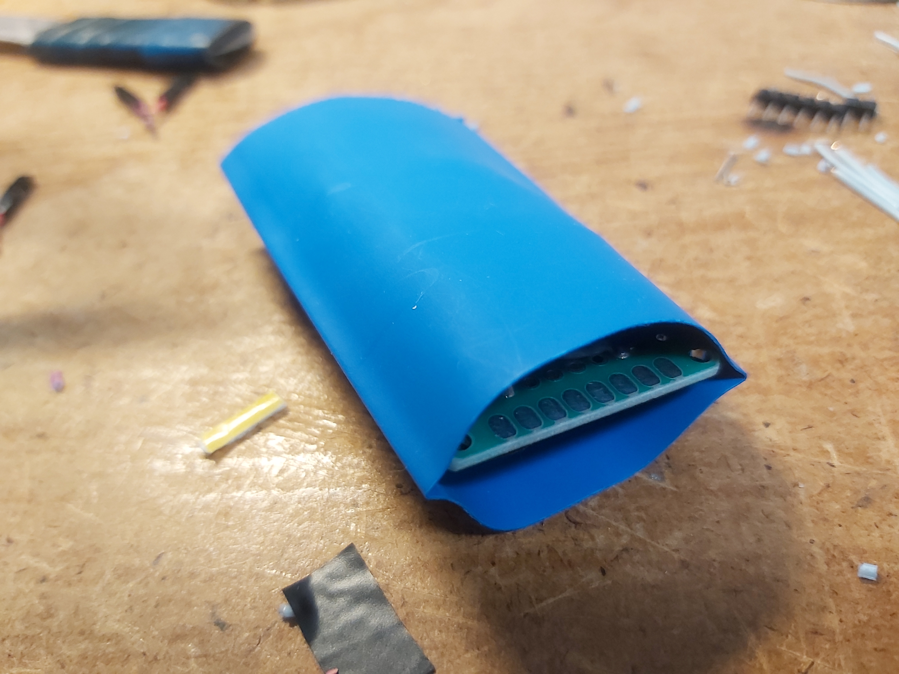
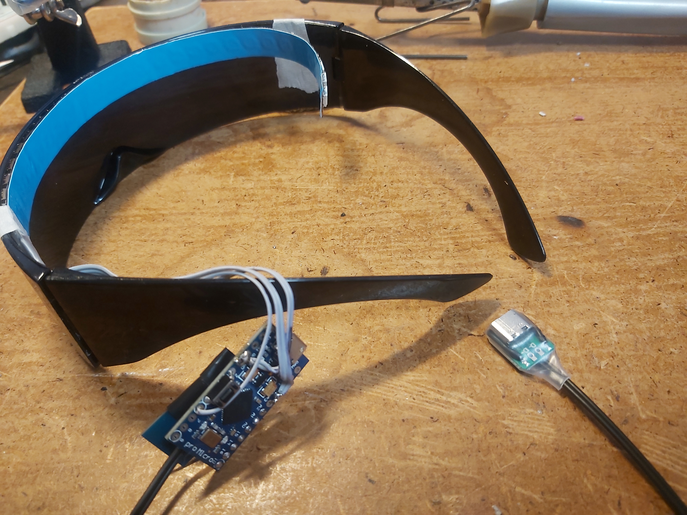
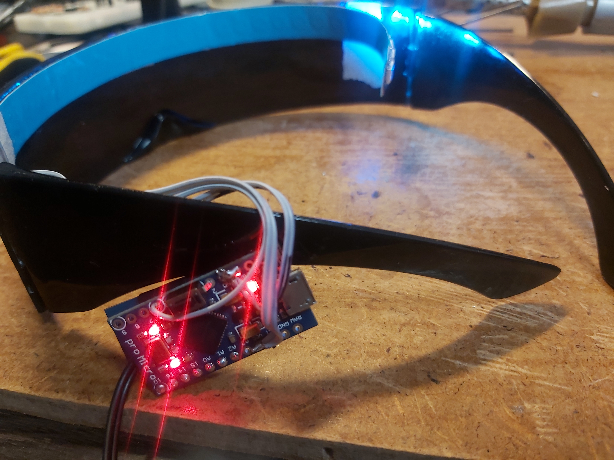
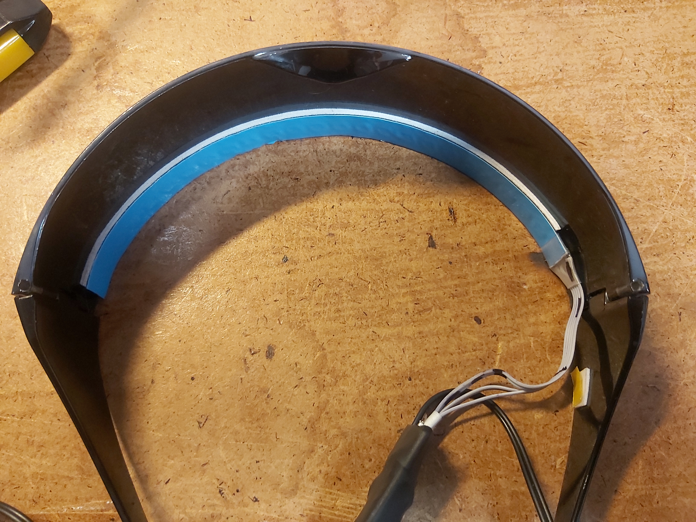
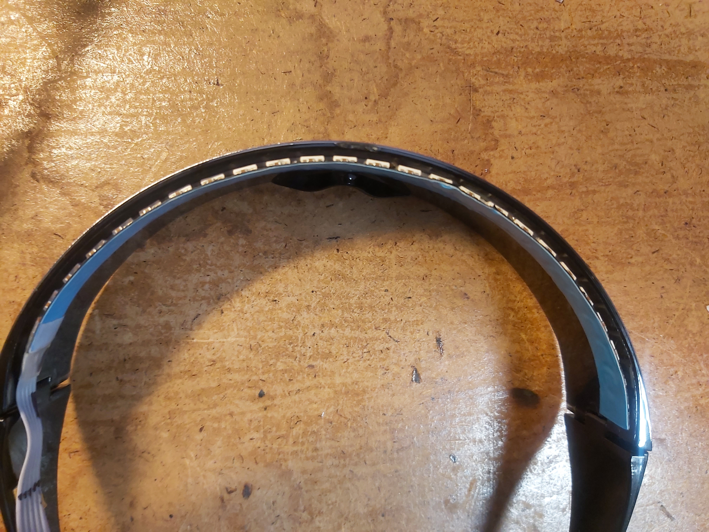
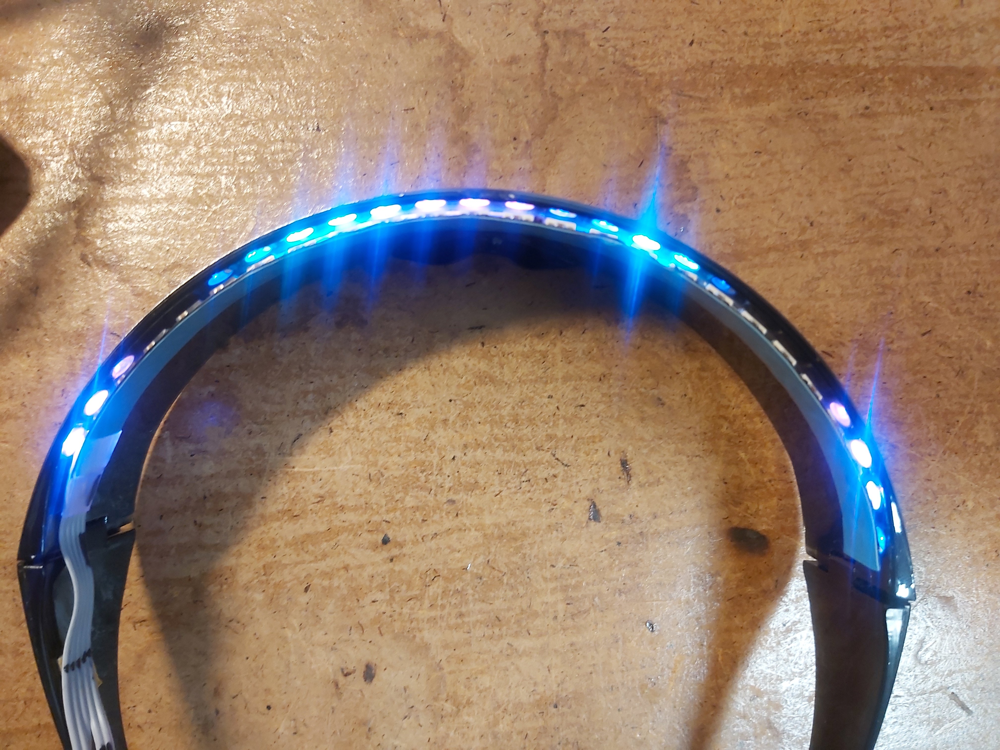

# Light glasses

  

Glasses with led strip attached.      
Remote control is implemented to change effects. Remote control is based on JDY-40 module and doesn't contain any other microcontroller.    
Remote control contains 7 buttons.
Glasses has other JDY-40 module paired with one in remote control.     

Remote control photo:  
   

## Making of

  
  
  
  
  
  
  
  